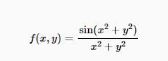

# Headings
# Hello World (Heading 1)
## Heading 2
### Heading 3
#### Heading 4
##### Heading 5
###### Heading 6

# Emphasis
*This text will be italic*
_This will also be italic_

**This text will be bold**
__This will also be bold__

_You **can** combine them_

# Lists
## Unordered
- Item 1
- Item 2
  - Item 2a
  - Item 2b
  - Item 2c
- Item 3
- Item 4

## Ordered
1. Item 1
2. Item 2
3. Item 3
   1. Item 3a
   2. Item 3b
   3. Item 3c
4. Item 4

# Links
You can create links by wrapping link text in brackets [ ], and then wrapping the URL in parentheses ( ). For example, to create a hyperlink to www.google.com, with the link text “Google”, you’d write this in Markdown: [Google](http://www.google.com)

# Images
You can add images to your R Markdown document by using the following syntax:


# Code
Inline `code` has `back-ticks around` it.

# Blockquotes
> Blockquotes are very handy in email to emulate reply text.
> This line is part of the same quote.

# R Code
You can add R code to your R Markdown document by using the following syntax:
```{r}
summary(cars)
str(cars)
head(cars)
```

The `plot()` function is used to create a scatter plot of two variables. For example, to create a scatter plot of the variables 'speed' and 'dist' in the 'cars' dataset, you'd write this in Markdown:
```{r}
plot(cars$speed, cars$dist)
```

# Session Info
You can add session info to your R Markdown document by using the following syntax:
```{r}
sessionInfo()
```


